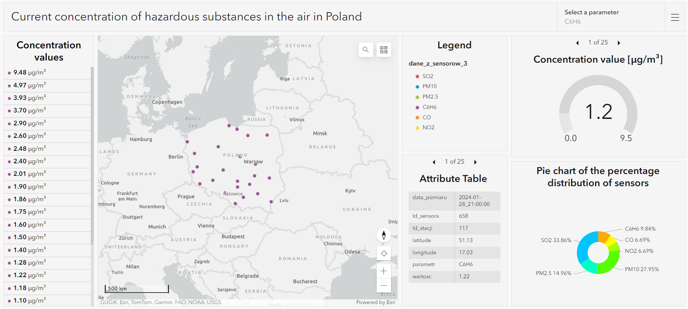

# Real Time Dashboard
# Dashboard: https://agh-ust.maps.arcgis.com/apps/dashboards/9f43cb8a004e487b86a8ce1f40ff52e6
### Dashboard shows current air pollution level of PM2.5, PM10, SO2, O3, NO2, C6H6 and CO in Poland. Moreover, there are many statistics describing the data. Data are updating every hour. 

#
To update data user must compile and run [main.py](https://github.com/filiphalys02/RealTimeDashboard/blob/main/main.py) code, but first it is necessary to update [logowanie.json](https://github.com/filiphalys02/RealTimeDashboard/blob/main/logowanie.json) file with login and password to ArcGis Online Account.  
  
Dashboard is divided into 7 sections:
- Map with sensor layer
- Legend
- Parameter selector
- List of measured values
- Attribute table
- Concentration calue chart
- Pie chart of the percentage distribution of sensors

  

The user can change the displayed view by selecting one of the parameters in the upper right corner of the dashboard.  
After clicking on one of the values in the list on the left side of the dashboard, the map zooms to the appropriate sensor. The statistics on the right side of the dashboard are then limited only to the selected sensor.

